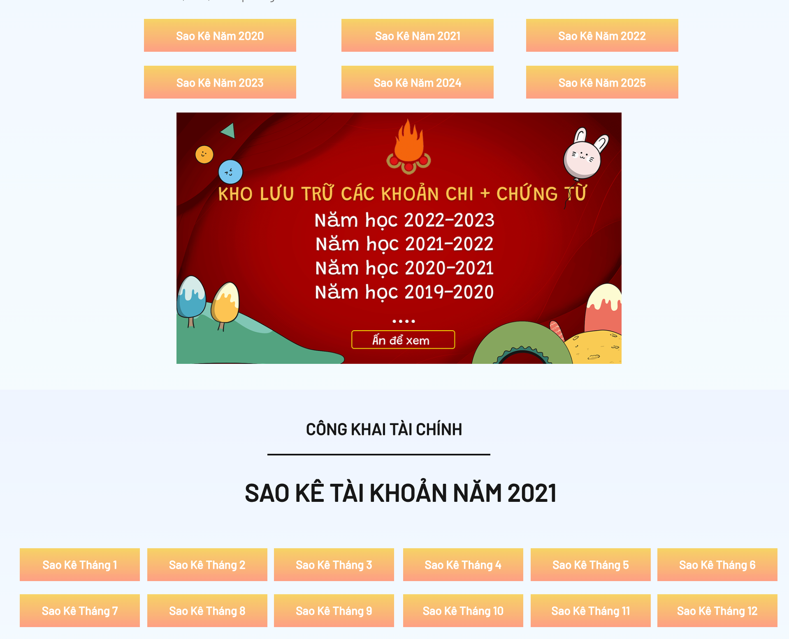

# Tổng quan

Dữ liệu thô được tải từ trang https://taichinh.nuoiem.com, đây là các dữ liệu sao kê do dự án Nuôi Em công khai.



- Sao kê được chia theo từng năm và từng tháng
- Tất cả các tệp sao kê được Publish to web, nên có thể tải về ở định dạng CSV, link tổng hợp nằm trong file [nuoiem.csv](nuoiem.csv)
- Riêng năm 2021, dữ liệu được bỏ trong cùng một file Google Spreadsheet (trùng ID), sao kê từng tháng là mỗi Sheet nên link có khác với các sao kê năm khác

## Thống kê dữ liệu sai

Dữ liệu thô bị sai rất nhiều về **nội dung** (trùng lặp, dư thừa các dữ liệu tháng khác) và **định dạng** (dư cột, sai tên cột, cột giống như nội dung khác nhau). Nên quá trình xử lý liệu phải kết hợp:

- Thủ công, kiểm tra dữ liệu bằng mắt thường
- Thủ công, với từng tệp dữ liệu riêng biệt (ví dụ xóa các phần thống kê)
- Thủ công, cập nhật lại các mã NE do nội dung giao dịch viết dính liền, thiếu chữ ...
- Tự động (chuẩn hóa tên cột, chuẩn hóa định dạng dữ liệu, extract thông tin từ nội dung giao dịch)

Thống kê các tệp dữ liệu sai, lí do để dễ tra cứu:

- `2020-sao-ke-thang-12-2020.csv` -> Có dữ liệu sao kê T01-2021
- `2021-sao-ke-thang-12-2021.csv` -> Sao kê T12-2021 bị sai nội dung cột `ngày`
- Toàn bộ dữ liệu sao kê năm 2022, cột `tham chiếu` dư dữ liệu `ngày`
- `2022-sao-ke-thang-1-2022.csv` -> Sao kê T01-2022 có dữ liệu sao kê T12-2022 và cột `tham chiếu` dư dữ liệu `ngày`

## Xử lí


- Xóa các nội dung tổng hợp trong các bản sao kê

```bash

> rg 'done' -l
2022-sao-ke-thang-6-2022.csv
2022-sao-ke-thang-1-2022.csv
2024-sao-ke-thang-10-2024.csv
2022-sao-ke-thang-7-2022.csv
2023-sao-ke-thang-7-2023.csv
2023-sao-ke-thang-11-2023.csv
2023-sao-ke-thang-10-2023.csv
2022-sao-ke-thang-4-2022.csv
2023-sao-ke-thang-4-2023.csv
2023-sao-ke-thang-3-2023.csv
2022-sao-ke-thang-5-2022.csv
2024-sao-ke-thang-4-2024.csv
2024-sao-ke-thang-1-2024.csv
2022-sao-ke-thang-12-2022.csv
2024-sao-ke-thang-11-2024.csv
2023-sao-ke-thang-12-2023.csv
2024-sao-ke-thang-5-2024.csv
2022-sao-ke-thang-9-2022.csv
2022-sao-ke-thang-10-2022.csv
2022-sao-ke-thang-8-2022.csv
2023-sao-ke-thang-6-2023.csv
2024-sao-ke-thang-7-2024.csv
2023-sao-ke-thang-5-2023.csv
2023-sao-ke-thang-2-2023.csv
2024-sao-ke-thang-6-2024.csv
2022-sao-ke-thang-11-2022.csv
2024-sao-ke-thang-9-2024.csv
2024-sao-ke-thang-8-2024.csv
2022-sao-ke-thang-2-2022.csv
2022-sao-ke-thang-3-2022.csv
2023-sao-ke-thang-9-2023.csv
2023-sao-ke-thang-8-2023.csv
2023-sao-ke-thang-1-2023.csv

2024-sao-ke-thang-4-2024.csv
2:Tổng Thu,11.773.926.287,Tổng ra,9.833.852.700,Tổng,21.607.778.987,THÁNG 12,done
5705:Tổng Thu,3.624.998.115,Tổng ra,3.679.775.400,Tổng,7.304.773.515,THÁNG 11,done
9758:Tổng Thu,5.787.839.401,Tổng ra,1.856.913.000,Tổng,7.644.752.401,THÁNG 10,done
16071:Tổng Thu,7.390.393.286,Tổng ra,7.880.298.000,Tổng,15.270.691.286,THÁNG 9,done
37280:Tổng Thu,10.501.313.423,Tổng ra,15.653.650.800,Tổng,26.154.964.223,THÁNG 7,done
47893:Tổng Thu,15.805.334.521,Tổng ra,12.476.618.151,Tổng,28.281.952.672,THÁNG 6,done
56012:Tổng Thu,17.683.264.671,Tổng ra,15.448.619.689,Tổng,33.131.884.360,THÁNG 5,done

2023-sao-ke-thang-9-2023.csv
82011:Tổng Thu,12.691.843.652,Tổng ra,12.736.755.000,Tổng,25.428.598.652,THÁNG 05,done
96461:Tổng Thu,12.033.892.758,Tổng ra,12.486.781.900,Tổng,24.520.674.658,THÁNG 04,done
99952:Tổng Thu,5.160.853.380,Tổng ra,4.491.889.814,Tổng,9.652.743.194,THÁNG 03,done
```

- Hầu hết sao kê có header là `Ngày,Tham chiếu,+/-,Số tiền,Nội dung giao dịch`, riêng sao kê 2020 `Ngày giao dịch,Số tham chiếu,Thay đổi,Số tiền,Mô tả` nên cần sửa lại
- Sao kê 2021 có phần thống kê tổng giao dịch, thu, chi ở ngay đầu tệp, cần loại bỏ

```bash
,Tổng số giao dịch,4160,,Tổng số tiền ,15.244.243.492
,Tổng giao dịch vào,0,, Tổng thu,7.097.325.542
, Tổng giao dịch ra,28,, Tổng chi,8.146.917.950
```